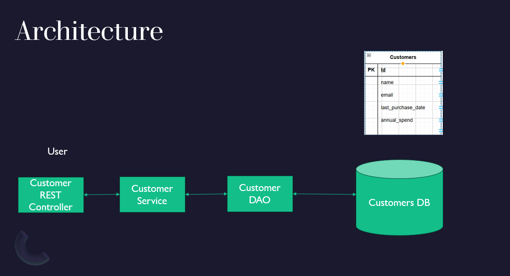

# CustomerAPI Project





---


# Customer API

A Spring Boot REST API to manage customer data.

---

## How to Build and Run the Application

### Prerequisites

- Java 17+
- Maven 3.x

### Steps

```bash
# Clone the repository
git clone [repo](https://github.com/coolgalsandiego/customers.git)

# Navigate into the project folder
cd customers

# Build the project
mvn clean install

# Run the application
mvn spring-boot:run
````

The application will start at:
**[http://localhost:8080](http://localhost:8080)**


---

## Instructions for Accessing the H2 Database Console

The H2 console is enabled for local development.

### Access URL

[http://localhost:8080/h2-console](http://localhost:8080/h2-console)

### Configuration

* JDBC URL: `jdbc:h2:file:./data/customerDb;AUTO_SERVER=TRUE`
* Username: `sa`
* Password: (password)

Ensure the following is present in `application.properties`:

```properties
spring.datasource.url=jdbc:h2:file:./data/customerDb;IFEXISTS=FALSE;AUTO_SERVER=TRUE;DB_CLOSE_DELAY=-1
spring.datasource.driverClassName=org.h2.Driver
spring.datasource.username=sa
spring.datasource.password=password
spring.jpa.database-platform=org.hibernate.dialect.H2Dialect
# Console
spring.h2.console.enabled=true
spring.h2.console.path=/h2-console
spring.jpa.hibernate.ddl-auto=update
```
make sure to run \customers\src\main\resources\sql\customers.sql inside project by logging into H2 console [http://localhost:8080/h2-console](http://localhost:8080/h2-console) and pasting the initial statement to create the required table structure and seed data

---


## Sample Requests to Test Endpoints

### 1. Create Customer

```http
POST /customers
Content-Type: application/json

{
  "name": "Priyanka Chaurishia",
  "email": "priyanka@example.com",
  "annualSpend": 2500.00,
  "lastPurchaseDate": "2024-06-15"
}
```

### 2. Get Customer by ID

```http
GET /customers/{id}
```
***Sample Request/Response***
```
Request :http://localhost:8080/customers/550e8400-e29b-41d4-a716-446655440000

Response:
{
  "id": "550e8400-e29b-41d4-a716-446655440000",
  "name": "Priya Sharma",
  "email": "priya@example.com",
  "annualSpend": 950.5,
  "lastPurchaseDate": "2023-04-12T07:00:00.000+00:00",
  "tier": "Silver"
}
```

### 3.a Get Customers by Name

```http
GET /customers?name=Priyanka
```

### 3.b Get Customers by Email

```http
GET /customers?email=Priyanka@example.com
```
### 4.Health Check

```http
GET /customers
```

Returns a simple message confirming the service is running.

### 5.Update an existing Customer

```http
PUT /customers/{id}
```

*** Sample Request/Response ***
```
Request:
{
  "id": "550e8400-e29b-41d4-a716-446655440000",
  "name": "Priya Kumari Sharma",
  "email": "priya@example.com",
  "annualSpend": 1950.5,
  "lastPurchaseDate": "2023-04-12T07:00:00.000+00:00",
  "tier": "Silver"
}
Response:
{
  "id": "550e8400-e29b-41d4-a716-446655440000",
  "name": "Priya Kumari Sharma",
  "email": "priya@example.com",
  "annualSpend": 1950.5,
  "lastPurchaseDate": "2023-04-12T07:00:00.000+00:00",
  "tier": "Silver"
}
```

Updates a customer with validated input.

### 5.Delete an existing Customer

```http
DELETE /customers/{id}
```


---

## Instructions for Accessing code coverage

The code coverage is available at following.

### Access URL

[/customers/target/site/jacoco/index.html](/customers/target/site/jacoco/index.html)

### How to run code coverage
```bash
mvn clean verify
```


---


## Instructions for Swagger Documentation

The swagger documentation is available at following.

### Access URL

[http://localhost:8080/docs](http://localhost:8080/docs)

---
## Assumptions Made

* Customer `id` is generated as a UUID.
* `name` is mandatory and validated using `@NotBlank`.
* `email` is validated using `@Email`.
* The application does not include authentication or authorization.
* An in-memory H2 database is used for development and testing.

---

## Running Tests

```bash
mvn test
```

JUnit tests cover controller-level validations using `@WebMvcTest`.

---

## Project Structure

```
com.pc.customers
│
├── controller      # REST controllers
├── dto             # Request and response models
├── service         # Business logic
├── dao             # Data access layer
├── model           # JPA entities
├── advice          # Global exception handler
└── CustomersApplication.java
```
---
## Javadocs
Can be viewed at [/customers/javadocs/index.html](/customers/javadocs/index.html)


---

## Contact

For any issues or suggestions, please contact the project maintainer (coolgalsandiego@gmail.com).


